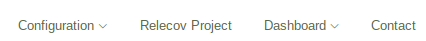
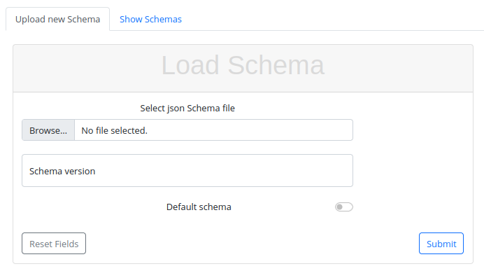
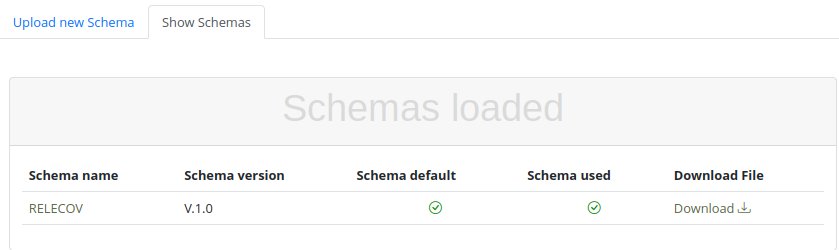
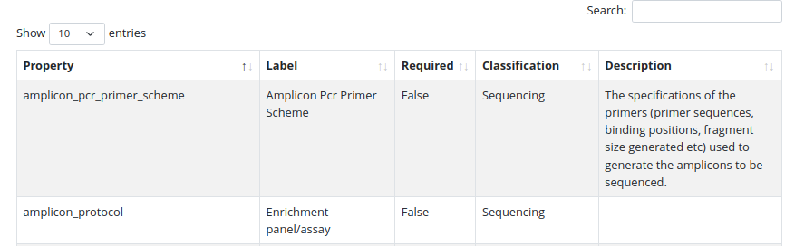

# Initial Configuration

Before start uploading METADATA information to Relecov you must configure some information.
The following chapters will show you the way that this information must be set in your local copy of relecov.

You must login as "admin" user to see the configuration Menu.

Note. That this menu is only available when login with user name as admin.

## Table of Contents
1. [Schema](#schema)
2. [Metadata](#metadata)

## Schema
The first step is to load the relecov schema into database.

For your convenience we have kept a schema for relecov in conf folder. Of course you can upload your own schema, but be aware that it could run into issues, because as we design "relecov platform" to be flexible, we have not tested any single scenario.

In the form select the relecov schema file, write the version of the schema and click on the Default schema button to define that this schema will be used as default settings.

Keep in mind that it is allowed to define as many schemas as you wish but only one must be the default one from where information must be filled.

Please be patient, as the upload process takes some time.

### Show schemas
Once the schema is loaded you can see the schemas defined in your system when clicking on "Show Schemas " tab.

Any schema is available for download, in json format, by click on the download button.

If you want to know more information about any schema, click on the desired schema name to get a table with all properties defined for this schema.

 

## Metadata

## Example
pepe
